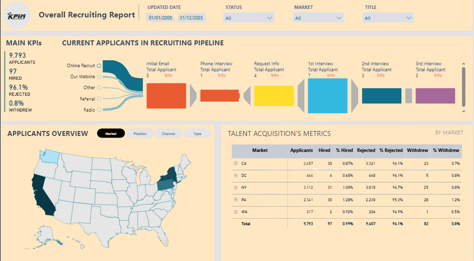

# Recruiting Analytics Dashboard | Power BI

## Project Overview

This project presents an interactive **Recruiting Analytics Dashboard** developed in Power BI to analyze recruitment performance, applicant flow, hiring outcomes, and talent acquisition metrics.

The dashboard provides data-driven insights into the recruitment pipeline, hiring trends, and process efficiency to support better decision-making.

## Dashboard Preview

## Business Objective

The objective of this project is to analyze recruitment performance and answer key business questions:

- How many candidates entered the recruitment pipeline?
- What percentage of applicants were hired, rejected, or withdrew?
- Which recruitment sources generated the highest number of applicants?
- How efficiently do candidates move through each recruitment stage?
- Which markets achieved better hiring outcomes?

## Key Performance Indicators (KPIs)

The dashboard tracks:

- Total Applicants
- Total Hires
- Total Rejected Candidates
- Current Applicants in Pipeline
- Hiring Rate (%)
- Rejection Rate (%)
- Withdrawal Rate (%)

## Dashboard Features

### Recruitment Funnel Analysis

Visualizes candidate progression through the recruitment process:

- Application Received
- Initial Screening
- First Interview
- Second Interview
- Final Interview
- Hiring Decision

### Applicant Source Analysis

Analyzes recruitment channels and their effectiveness:

- Company Website
- Online Recruitment Platforms
- Employee Referrals
- Recruiters
- Other Sources

### Market Performance Analysis

Compares recruitment performance across different markets:

- Applicant volume
- Number of hires
- Hiring percentage
- Rejection percentage
- Withdrawal percentage

## Tools & Technologies

- Power BI
- Power Query
- DAX
- Excel / CSV Dataset
- Data Visualization
- KPI Development

## Data Preparation

Data preparation and transformation included:

- Removing duplicate records
- Handling missing values
- Creating calculated columns
- Building data relationships
- Developing DAX measures

## Business Insights

Examples of insights generated:

- Identified conversion rates across recruitment stages.
- Compared hiring performance across different markets.
- Evaluated the effectiveness of recruitment channels.
- Highlighted opportunities to improve recruitment efficiency.

## Skills Demonstrated

- Business Analysis
- Requirements Understanding
- Data Analysis
- Dashboard Design
- KPI Reporting
- Stakeholder-Oriented Reporting
- Power BI Development

## Project Files

- Power BI Dashboard (.pbix)
- Dataset (.xlsx/.csv)
- Dashboard Screenshot
- Project Documentation

## Author

**Leila Khosravi**  
Business Analyst | Data Analytics | Process Improvement

GitHub: https://github.com/Leila-khosravi  
LinkedIn: https://www.linkedin.com/in/leila-khosravi-8b473380
